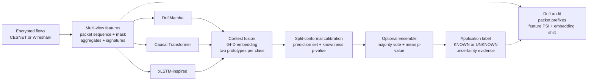

# Open-World Encrypted Network Anomaly Detection and Traffic Classification

**NetAnomaly-OW** is a leakage-aware research system for classifying encrypted QUIC application
traffic while rejecting applications that were absent from training. It uses privacy-preserving
flow metadata—never decrypted payloads—and compares selective state-space, attention, stabilized
recurrent, and heterogeneous ensemble pipelines under the same chronological protocol.


> [!IMPORTANT]
> `UNKNOWN` means that a flow is statistically inconsistent with the trained application classes.
> It does **not** prove that the flow is malicious. This is an open-world encrypted-traffic
> classifier and novelty-triage system, not a production intrusion-detection appliance.

## Why this project is different

Conventional traffic classifiers assume every test application appeared during training. Real
networks violate that assumption as new services, software updates, behavioural changes, and domain
shift appear. NetAnomaly-OW therefore solves two connected problems:

1. **Known-application classification:** identify one of the applications learned during training.
2. **Open-world rejection:** return `UNKNOWN` when calibrated evidence does not support a known class.

The project demonstrates:

- flow reconstruction from Wireshark-style exports and CESNET DataZoo records;
- packet-size, direction, and timing sequences without payload inspection;
- aggregate statistics and second-order path-signature context;
- DriftMamba, a causal Transformer, and an xLSTM-inspired encoder;
- multi-prototype hyperspherical classification;
- split-conformal prediction sets and known-traffic p-values;
- heterogeneous ensemble voting;
- classification after 8, 16, 32, or 64 packets;
- chronological feature and embedding-drift audits;

## Verified project status

The repository has been exercised locally with the official CESNET-QUIC22 XS edition.

| Check | Verified result |
|---|---|
| Automated tests | **11 passing** |
| Static analysis | Ruff passing |
| Frozen-checkpoint inference | 1,000/1,000 flows processed |
| Known-test acceptance | 890/1,000 (**89.0%**) |
| Known-test rejection | 110/1,000 (**11.0%**) |
| Mean conformal set size | **1.53** labels |

## Headline benchmark

The bounded smoke experiment uses one seed and one chronological week transition. These are genuine
saved-report results, not synthetic unit-test metrics.

| Pipeline | Accuracy | Balanced accuracy | Macro-F1 | Unknown AUROC | Primary strength |
|---|---:|---:|---:|---:|---|
| **Heterogeneous deep ensemble** | **0.8230** | **0.7191** | **0.7264** | 0.6433 | Overall classification |
| Causal Transformer | 0.8060 | 0.7046 | 0.6981 | 0.6090 | Individual accuracy |
| xLSTM-inspired encoder | 0.7990 | 0.7087 | 0.6901 | 0.5643 | Early classification |
| **DriftMamba-12** | 0.7550 | 0.6253 | 0.6435 | **0.7011** | Neural unknown separation |

The ensemble performs majority application voting and averages calibrated known-traffic p-values
across DriftMamba, Transformer, and xLSTM. It is a heterogeneous model family, not repeated seeds
of one architecture.

### Operational flagging at `alpha = 0.10`

Each evaluation contains 1,000 known and 1,000 held-out-unknown flows.

| Pipeline | All flagged | Known flagged | Unknown flagged | Not flagged | Unknown recall | Known acceptance |
|---|---:|---:|---:|---:|---:|---:|
| DriftMamba-12 | 402 | 110 | 292 | 1,598 | **29.2%** | 89.0% |
| Transformer | 278 | 88 | 190 | 1,722 | 19.0% | 91.2% |
| xLSTM-inspired | 237 | 92 | 145 | 1,763 | 14.5% | 90.8% |
| Deep ensemble | 167 | 51 | 116 | 1,833 | 11.6% | **94.9%** |

More flags are not automatically better. Known flagged flows are false rejections or rare legitimate
behaviour; held-out unknown flagged flows are successful novelty detections.

## System architecture



### Multi-view representation

| View | Representative variables | Purpose |
|---|---|---|
| Packet sequence | Signed size, direction, inter-arrival time, validity mask | Preserve request-response order |
| Aggregate context | Duration, packet/byte counts, ratios, robust summaries | Describe the complete flow |
| Path signature | Second-order size/direction/time interactions | Encode ordered trajectory shape |
| Operational context | Protocol, port group, chronological time | Support splitting and drift windows |

Packet observations form `[batch, 64, 3]` tensors with `[batch, 64]` validity masks. Masked
sequence pooling is fused with aggregate and signature projections to create a normalized
64-dimensional embedding. Each known application owns two learnable prototypes.

### Model family

- **DriftMamba:** portable pure-PyTorch selective-state scan with input-dependent candidate, write,
  read, and step gates. It provides causal `O(L)` processing. It is Mamba-inspired and does not
  claim binary equivalence to the official CUDA kernels.
- **Causal Transformer:** learned positions, four-head masked self-attention, key-padding masks,
  pre-normalization, and GELU feed-forward blocks with `O(L²)` attention cost.
- **xLSTM-inspired encoder:** stabilized exponential gates and normalized scalar memory for causal
  `O(L)` recurrence. It is inspired by xLSTM rather than the full upstream package.
- **Deep ensemble:** majority application vote plus the mean calibrated knownness p-value.

Training combines cross-entropy with a hard-negative prototype margin. Split-conformal calibration
is fitted on a disjoint known calibration partition. A p-value below `alpha` produces `UNKNOWN`.

## Dataset and leakage-free evaluation

The main experiment uses **CESNET-QUIC22 XS**. The dataset is not committed because it is large;
the DataZoo command below obtains it locally.

| Partition | Flows | Applications | Chronological role |
|---|---:|---|---|
| Training | 5,000 | 15 known | Week 44; fit weights and prototypes |
| Calibration | 1,000 | Same 15 known | Week 44; stopping and conformal calibration |
| Known test | 1,000 | Same 15 known | Week 45; closed-set evaluation |
| Unknown test | 1,000 | 58 held-out classes | Week 45; open-world evaluation |

Leakage controls:

- the chronological split occurs before preprocessing;
- scalers, category mappings, labels, weights, and prototypes use training data only;
- conformal scores use the disjoint calibration partition;
- complete application classes are held out as unknowns;
- final test data do not select thresholds or update parameters;
- payload contents and raw endpoint identifiers are not model features.

## Installation

### Windows PowerShell

```powershell
git clone https://github.com/Nish-011-100/Open-World-Encrypted-Network-Anomaly-Detection-and-Traffic-Classification.git
cd Open-World-Encrypted-Network-Anomaly-Detection-and-Traffic-Classification

python -m venv .venv
Set-ExecutionPolicy -Scope Process -ExecutionPolicy Bypass
.\.venv\Scripts\Activate.ps1

python -m pip install --upgrade pip
python -m pip install -e ".[deep,notebooks,datazoo,dev]"
```

`mamba-ssm` is optional on Windows; the portable selective scan runs with ordinary PyTorch.

### macOS or Linux

```bash
git clone https://github.com/Nish-011-100/Open-World-Encrypted-Network-Anomaly-Detection-and-Traffic-Classification.git
cd Open-World-Encrypted-Network-Anomaly-Detection-and-Traffic-Classification
python3 -m venv .venv
source .venv/bin/activate
python -m pip install --upgrade pip
python -m pip install -e ".[deep,notebooks,datazoo,dev]"
```

## What a GitHub clone contains

A clone contains the complete source code, tests, configuration, executed notebooks with
embedded plots, tracked benchmark summaries, and the research PDF. Large CESNET datasets, generated
model checkpoints, and detailed per-flow reports are intentionally Git-ignored.

Therefore:

- tests, linting, documentation, tracked plots, and the research report work immediately after
  dependency installation;
- fresh training requires preparing the CESNET data first;
- command-line inference requires a checkpoint and preprocessor produced by training;
- `artifacts/` and `reports/` are created automatically when the relevant commands run.

## Running in VS Code

1. Open `NetAnomaly-OW.code-workspace`.
2. Install the Microsoft **Python**, **Python Debugger**, and **Jupyter** extensions.
3. Select `.venv/Scripts/python.exe` on Windows or `.venv/bin/python` on macOS/Linux.
4. Open **Run and Debug** (`Ctrl+Shift+D`).
5. Select `NetAnomaly: Run inference`, `NetAnomaly: Quick train (1 epoch)`, or
   `NetAnomaly: Build report`.
6. Press `F5`.

The workspace also provides installation, test, and Ruff tasks.

## Verify a fresh clone

```powershell
python -m pytest -q
ruff check .
```

Expected result:

```text
11 passed
All checks passed!
```

## Run inference after training

After preparing data and training a model, run:

```powershell

driftmamba-detect `
  --input data\processed\datazoo_smoke\test_known.csv `
  --models-directory artifacts\datazoo_smoke\driftmamba_12ep `
  --preprocessor data\processed\datazoo_smoke\aggregate_preprocessor.joblib `
  --output reports\local_run\known_test_predictions.csv `
  --maximum-packets 64 `
  --alpha 0.10
```

Expected summary:

```json
{
  "flows": 1000,
  "known": 890,
  "unknown": 110,
  "mean_prediction_set_size": 1.53
}
```

Because this uses `test_known.csv`, the 110 `UNKNOWN` decisions are false rejections—not attacks.
Use `test_unknown.csv` to examine held-out application recall.

## Preparing CESNET-QUIC22

```powershell
driftmamba-export-datazoo `
  --edition XS `
  --data-root data\raw\cesnet-quic22 `
  --output-directory data\processed\datazoo_xs `
  --known-applications 15 `
  --train-rows 100000 `
  --calibration-rows 20000 `
  --known-test-rows 20000 `
  --unknown-test-rows 20000
```

The export redacts endpoints, constructs canonical flows, creates chronological partitions, fits
preprocessing on training data only, and writes tensors plus a split manifest.

## Training

### Quick DriftMamba smoke run

```powershell
driftmamba-train-deep `
  --data-directory data\processed\datazoo_smoke `
  --models-directory artifacts\quick_test\driftmamba `
  --reports-directory reports\quick_test\driftmamba `
  --encoder driftmamba `
  --epochs 1 `
  --batch-size 128 `
  --alpha 0.10 `
  --seed 42
```

For the benchmark, use 12 epochs and repeat with `--encoder transformer` and `--encoder xlstm`,
keeping the split, seed, packet budget, and calibration policy fixed.

### Evaluate the ensemble

```powershell
driftmamba-evaluate-ensemble `
  --predictions `
    reports\datazoo_smoke\driftmamba_12ep\deep_predictions.csv `
    reports\datazoo_smoke\transformer_12ep\deep_predictions.csv `
    reports\datazoo_smoke\xlstm_12ep\deep_predictions.csv `
  --output-directory reports\datazoo_smoke\deep_ensemble
```

## Prediction output

| Column | Meaning |
|---|---|
| `PredictedApplication` | Nearest known application prediction |
| `KnownTrafficPValue` | Calibrated evidence for known traffic |
| `NearestPrototypeSimilarity` | Similarity to the closest learned prototype |
| `PredictionSet` | Conformal set of plausible known applications |
| `PredictionSetSize` | Number of labels in the set |
| `Decision` | Predicted application or `UNKNOWN` |
| `EmbeddingNorm` | Representation diagnostic |

## Notebooks and plots

```powershell
jupyter lab notebooks
```

- `01_data_exploration.ipynb`: splits, class balance, distributions, chronological activity,
  duration/volume relationships, and packet profiles.
- `02_model_evaluation.ipynb`: model comparison, novelty trade-offs, flag composition, acceptance,
  unknown recall, and early-flow performance.
- `03_model_training.ipynb`: reproducible DriftMamba, Transformer, and xLSTM training commands,
  training/calibration loss curves, and best-epoch comparison. Its tracked plots work immediately;
  set `RUN_TRAINING = True` only after preparing the processed dataset to train fresh models.

Small benchmark values and training histories in `results/` are tracked so evaluation and convergence
plots work after cloning. Large predictions, datasets, and checkpoints remain Git-ignored.

## CLI reference

| Command | Purpose |
|---|---|
| `driftmamba-build-flows` | Convert Wireshark-style packet exports into canonical flows |
| `driftmamba-prepare` | Prepare chronological partitions |
| `driftmamba-export-datazoo` | Download/export CESNET DataZoo subsets |
| `driftmamba-train-baselines` | Train classical baselines |
| `driftmamba-train-deep` | Train DriftMamba, Transformer, Hyena, or xLSTM encoders |
| `driftmamba-train-autoencoder` | Run the legacy autoencoder ablation |
| `driftmamba-evaluate-ensemble` | Combine aligned deep-model predictions |
| `driftmamba-detect` | Run frozen-artifact inference |

## Repository structure

```text
NetAnomaly-OW/
|-- .github/workflows/       Continuous-integration checks
|-- .vscode/                 VS Code settings, launch profiles, and tasks
|-- configs/                 Reproducible experiment configuration
|-- data/
|   |-- raw/README.md        Raw-data placement instructions
|   `-- processed/README.md  Prepared-data layout instructions
|-- docs/
|   |-- EXPERIMENT_RESULTS.md
|   |-- PROJECT_HANDOFF.md
|   `-- README.md
|-- notebooks/
|   |-- 01_data_exploration.ipynb
|   |-- 02_model_evaluation.ipynb
|   `-- 03_model_training.ipynb
|-- output/pdf/              Final rendered research report
|-- results/
|   |-- model_comparison.csv
|   |-- flagging_summary.csv
|   |-- early_classification.csv
|   `-- training_history.csv
|-- scripts/                 Experiment and report automation
|-- src/driftmamba/          Installable Python package and CLI implementation
|-- tests/                   Data, model, inference, and pipeline tests
|-- .gitignore
|-- LICENSE
|-- NetAnomaly-OW.code-workspace
|-- pyproject.toml
`-- README.md
```

Training and inference create `artifacts/` for checkpoints and `reports/` for detailed metrics and
per-flow predictions. These runtime directories are intentionally Git-ignored and therefore do not
appear in a fresh clone until a relevant command is executed. Downloaded and processed dataset files
are likewise ignored; only their placement instructions are tracked.

The public project name is **NetAnomaly-OW**. The internal `driftmamba` Python namespace and
`driftmamba-*` CLI prefix are retained intentionally because DriftMamba is the primary proposed
encoder and these names form the stable implementation interface.

## Research report

[`Open-World-Encrypted-Network-Anomaly-Detection-and-Traffic-Classification-Report.pdf`](output/pdf/Open-World-Encrypted-Network-Anomaly-Detection-and-Traffic-Classification-Report.pdf)
contains the protocol, architecture, model mechanics, results, risk analysis, and threats to validity.

## Limitations

- Headline values use one dataset edition, one chronological transition, and one seed.
- Unknown recall is modest at the conservative operating threshold.
- The project recognizes applications and novelty; it does not establish malicious intent.
- Cross-network inference may introduce substantial domain shift.
- Latency, memory, parameter counts, confidence intervals, and external validation are still needed
  for deployment claims.
- DriftMamba and xLSTM are portable inspired implementations, not exact upstream packages.

## Privacy and responsible use

Analyze only traffic that you own or are authorized to inspect. Captures may expose endpoints,
domains, application usage, or payload content. The project redacts endpoint identifiers and avoids
payload decryption, but users remain responsible for lawful data collection, storage, and sharing.

## Roadmap

- repeat the benchmark over 3-5 seeds with confidence intervals;
- add per-class metrics and risk-coverage curves;
- benchmark latency, throughput, memory, and parameter counts;
- validate on an external encrypted-traffic dataset;
- add architecture and feature ablations;
- package a small downloadable demonstration checkpoint;
- add continuous integration after connecting the GitHub repository.

## Final interpretation

NetAnomaly-OW is a functioning, reproducible ML/DL research prototype for privacy-preserving
encrypted traffic classification and open-world novelty rejection. It is suitable for research,
portfolio demonstration, and controlled experimentation—not as a substitute for a production
security analyst or verified intrusion-detection system.

## License

Copyright © 2026 Nishika Manish Kakrecha. This project is released under the
[MIT License](LICENSE).
